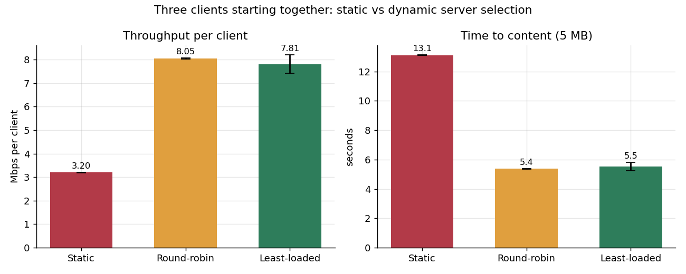

# SDN Content Delivery with Dynamic Server Selection

Three content servers, three clients, and an SDN controller that decides — per TCP connection —
which server answers and which path the traffic takes, based on live network conditions.
Built with raw Python sockets, Mininet and a custom Ryu (OpenFlow 1.3) controller.



## Results at a glance

Measured with an automated runner: 4 scenarios × 8 configurations × 3 repetitions, **24/24 runs succeeded**.

| Experiment | Baseline | This controller | Improvement |
|---|---|---|---|
| 3 clients download 5 MB at the same instant | static: 3.2 Mbps, 13.1 s wait | dynamic: ~8 Mbps, ~5.4 s wait | **2.5× throughput** |
| 25 Mbps flood on the fast path | congestion-blind: worst wait 42.8 s, 5 failed attempts | congestion-aware: worst wait 5.4 s, 0 failed | **7.9× lower worst case** |
| A server is killed mid-run | static: 0 of 36 downloads completed | least-loaded: 36 of 36 completed | **0% → 100%** |
| Fast-path link cut and restored | — | 18 of 18 completed, 0 retries | **invisible to clients** |

Full analysis: [docs/REPORT.md](docs/REPORT.md).

## How it works

```
                 +---- s2 ----+        fast path  (2 ms/hop, 20 Mbps)
   h1 -+         |            |         +- srv1  10.0.0.11  (1 ms)
   h2 -+-- s1 ---+            +-- s4 ---+- srv2  10.0.0.12  (5 ms)
   h3 -+         |            |         +- srv3  10.0.0.13  (10 ms)
  sink-+         +---- s3 ----+   gen --+
                                       slow path (10 ms/hop, 20 Mbps)
```

- Clients connect to one **virtual IP, 10.0.0.100:9000**. No host owns it: the controller answers its
  ARP and, on each connection's first packet, picks a server and installs OpenFlow rules that rewrite
  addresses in both directions. All later packets are switched without the controller.
- **Server selection** (`LB_POLICY`): `static` (baseline), `round_robin`, or `least_loaded`
  (fewest active connections, ties broken by proximity).
- **Socket–SDN integration**: every server sends a UDP load report to the controller each second;
  missing reports for 3 s mark a server DOWN.
- **Network monitoring**: every 2 s the controller reads OpenFlow port counters and computes per-link
  utilisation. With `PATH_POLICY=congestion`, each connection gets its own path that avoids links
  above 70% utilisation.
- **Rerouting**: link failures (OpenFlow `PortStatus`) trigger path recomputation over the surviving
  links, including for transfers already in progress.
- No spanning tree is needed: the controller never floods, so the topology loop is harmless and both
  paths stay usable.

## Repository layout

| Path | Contents |
|---|---|
| `app/` | `server.py`, `client.py`, `protocol.py` (raw TCP/UDP sockets), `make_content.py` |
| `controller/` | `lb_controller.py` (Ryu app), `net_config.py` (network map) |
| `topology/` | `topo.py` (Mininet topology) |
| `tests/` | `run_experiments.py` (automated experiments), `make_graphs.py` (plots) |
| `results/` | raw logs and CSVs; `results/experiments/<batch>/` per experiment batch, with `graphs/` |
| `docs/` | `REPORT.md`, `ARCHITECTURE.md`, `VIVA_QA.md`, `evidence/` (screenshots and results tables) |

## Setup

Tested on Ubuntu (22.04 and 26.04) in a VM. Ryu needs Python 3.9, so it gets its own environment;
Mininet uses the system Python.

```bash
sudo apt install -y mininet openvswitch-switch iperf python3-matplotlib git curl
curl -LsSf https://astral.sh/uv/install.sh | sh && source $HOME/.local/bin/env
uv python install 3.9 && uv venv --python 3.9 --seed ~/ryu-env
source ~/ryu-env/bin/activate
pip install setuptools==67.6.1 wheel==0.43.0 pbr
pip install --no-build-isolation ryu eventlet==0.30.2
deactivate

git clone https://github.com/mayureshyalgi/sdn-content-delivery.git ~/sdn-content-delivery
cd ~/sdn-content-delivery && python3 app/make_content.py
```

A step-by-step guide for Windows/VirtualBox is in `SETUP_GUIDE_WINDOWS.html` (from the team share).

## Running it by hand

Order matters: **cleanup → controller → network** (`mn -c` kills a running controller).

```bash
# Terminal 2
sudo mn -c
# Terminal 1
cd ~/sdn-content-delivery && source ~/ryu-env/bin/activate
LB_POLICY=least_loaded PATH_POLICY=congestion ryu-manager controller/lb_controller.py
# Terminal 2
cd ~/sdn-content-delivery && sudo python3 topology/topo.py
```

At the `mininet>` prompt (write names with `=`: Mininet replaces a bare host name with its IP):

```
srv1 python3 app/server.py --name=srv1 > results/srv1.log 2>&1 &
srv2 python3 app/server.py --name=srv2 > results/srv2.log 2>&1 &
srv3 python3 app/server.py --name=srv3 > results/srv3.log 2>&1 &
h1 python3 app/client.py --name=h1 --server 10.0.0.100 --file medium.bin --count 6
link s1 s2 down
sh ovs-ofctl -O OpenFlow13 dump-flows s1
```

## Live demo dashboard

```bash
sudo python3 dashboard/demo.py        # then open http://localhost:8080
python3 dashboard/demo.py --sim       # rehearse without Mininet
```

Starts the controller, network and servers, and drives every scenario from a web page: requests,
server and link failures, a congestion flood, policy changes, with live link use, paths and
response times. See [dashboard/README.md](dashboard/README.md).

## Running the experiments

```bash
sudo mn -c
sudo python3 tests/run_experiments.py            # 24 runs, ~17 min
sudo python3 tests/run_experiments.py --reps 1   # quick pass, ~6 min
python3 tests/make_graphs.py                     # graphs for the newest batch
```

The runner starts and stops its own controller and network; nothing else should be running.

## Team

| Role | Responsibility |
|---|---|
| Application & sockets | server, client, protocol, load reporting, measurement |
| SDN controller | ARP and routing, selection policies, flow rules, health checks, monitoring, rerouting |
| Topology, testing & evaluation | Mininet topology, failure injection, experiment runner, graphs, documentation |
