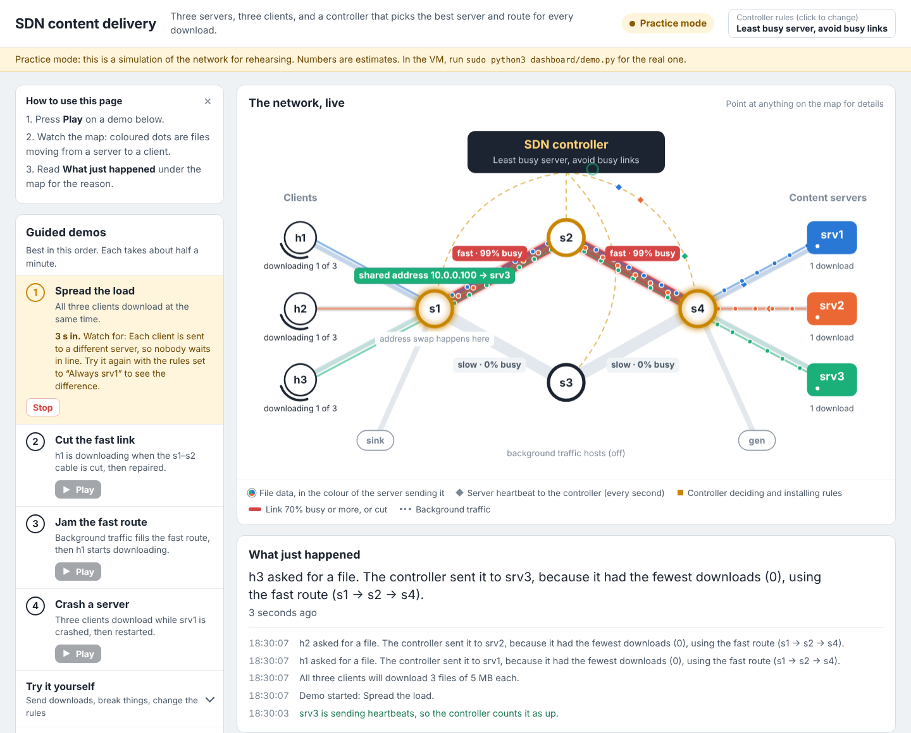

# Demo dashboard

A web page that runs the whole demo. One command starts the controller, the Mininet network and the
three content servers; the page then shows what the controller is doing and lets you trigger every
scenario from the browser.



*The “Spread the load” demo in practice mode: each client is sent to a different server, and the
story under the map says why.*

## Start it

From the project folder, with nothing else running (it cleans up old Mininet itself):

```bash
cd ~/sdn-content-delivery
sudo python3 dashboard/demo.py
```

Open **http://localhost:8080** in the VM's browser. Startup takes about 15 seconds (controller,
switches, then the three servers reporting UP). The terminal keeps the usual `mininet>` prompt as a
backup; type `exit` there to stop everything.

### Open it from your Mac (network still runs in the VM)

```bash
sudo python3 dashboard/demo.py --host 0.0.0.0
```

The terminal prints the address to use, e.g. `http://192.168.64.5:8080`. Open that in Safari or
Chrome on the Mac. Everything you click there acts on the real Mininet network inside the VM. With
UTM's default *Shared Network* the Mac can reach the VM directly; if it can't, check the VM's network
mode in UTM.

| Option | Meaning |
|---|---|
| `--policy static` / `round_robin` / `least_loaded` | Server policy to start with (default `least_loaded`) |
| `--path-policy delay` / `congestion` | Path policy to start with (default `congestion`) |
| `--port 8081` | Use another port if 8080 is busy |
| `--host 0.0.0.0` | Open the page from another computer, e.g. the Mac, at `http://<VM IP>:8080` |
| `--sim` | Simulated network: no sudo, no Mininet (see below) |

Every session's logs and CSVs are saved in `results/demo/<date_time>/`: one log per controller start,
`decisions.csv`, `h1.csv`…`h3.csv`, server logs and flood output.

## What's on the page

The page is built so someone who has never seen SDN can follow it:

- **Guided demos** (left): four demos in the suggested order, *Spread the load*, *Cut the fast
  link*, *Jam the fast route* and *Crash a server*. Press **Play**; while it runs, the card says what to
  watch for (worded for the current controller rules). Finished demos get a tick.
- **Try it yourself** (under the demos, folded away): send downloads, crash or restart a server, cut or
  repair a link, start background traffic. **Fix everything** puts the network back to normal.
- **Controller rules** (top right): click to choose how the controller picks a server (*Least busy
  server*, *Take turns*, *Always srv1*) and a route (*Avoid busy links*, *Shortest route only*). The
  technical names (`least_loaded`, `congestion`, …) are shown under each choice.
- **The network, live** (centre), drawn like a metro map:
  - File data moves as dots from server to client, in the server's colour.
  - Each server's heartbeat (its UDP load report) travels to the controller every second.
  - On every new download the controller is asked "which server?" (PACKET_IN), installs rules on
    each switch on the route (FLOW_MOD), and s1 shows the address swap, e.g. `shared address
    10.0.0.100 → srv2`.
  - Links show how busy they are and turn red at 70% or when cut; reroutes are announced on the map.
  - Point at anything for details.
- **What just happened**: every decision and failure explained in one plain sentence, newest first,
  e.g. "h1 asked for a file. The controller sent it to srv2, because it had the fewest downloads (0),
  using the slow route, because the fast route is jammed."
- **Server cards**: running or crashed, downloads now, last heartbeat, and totals for the session.
- **Details** (tabs at the bottom):
  - *Over time*: how busy each route is, and how long each download took, with your actions marked.
  - *Switch rules*: the real OpenFlow table of s1–s4 from `ovs-ofctl dump-flows`, each rule explained
    ("address swap", "one download's route", "ask the controller").
  - *Activity log*: the controller's own log lines and its decision table.
  - *Measured results*: the comparison from `tests/run_experiments.py` and its graphs.

## Suggested demo (about 10 minutes)

1. **Spread the load.** Each client lands on a different server; point at "What just happened".
2. **Cut the fast link.** Run *Cut the fast link*. At 6 s s1–s2 turns red, the connection moves to s1–s3–s4, the slow
   path line rises on the chart, and no request fails.
3. **Jam the fast route.** Run *Jam the fast route*. The flood fills the fast path to 100%; h1 is sent through
   s3. Then set the route rule to *Shortest route only* and run it again: h1 now goes into the congested path and
   waits much longer, with retries.
4. **Crash a server.** With *Least busy server*, run *Crash a server*: srv1's process is killed at 6 s; within
   3 s the controller logs `[HEALTH] srv1 is DOWN` (no load reports) and new requests go to srv2 and srv3. Set *Always srv1* and run it again: requests keep going to the dead srv1
   and fail.
5. **Measured results** tab. Close with the measured comparison from the automated runs.

Use **Fix everything** between demos, and **Clear the charts** for a clean timeline.

## Rehearsal without Mininet

```bash
python3 dashboard/demo.py --sim
```

Same page and controls, driven by a simple model of the network. Behaviour matches the real system
(policies, failure detection after 3 s, congestion-aware paths, retries), but the numbers are rough
estimates; a banner says so. Works on any computer with Python 3, including the Mac.

## How it connects to the project

- `demo.py` builds the same topology as `topology/topo.py`, starts `controller/lb_controller.py` the
  same way `tests/run_experiments.py` does, and runs the real `app/server.py` and `app/client.py` in
  the Mininet hosts. Link failures use `net.configLinkStatus`, the flood uses `iperf` from `gen` to
  `sink`, exactly as in the experiments.
- The controller writes a JSON snapshot every second when `LB_STATE_JSON` is set (only `demo.py`
  sets it, so hand runs and the experiment runner are unchanged). It holds server state, per-link
  utilisation and the path each live connection is using.
- The OpenFlow tab runs `ovs-ofctl -O OpenFlow13 dump-flows sN` in the VM each time it refreshes, so it
  shows exactly what is in the switch. The animation is driven by the same state: connection paths
  come from the controller, link load from its port statistics, decisions from its decisions CSV.
  Packet dots are a visual rate indicator, not a packet-by-packet capture.
- Changing the policy restarts the controller with new `LB_POLICY` / `PATH_POLICY` values and clears
  the old rules from the switches. Downloads must finish first.
- The web server listens on localhost only by default, because it runs as root and can kill
  processes.

## Troubleshooting

| What you see | Fix |
|---|---|
| `ryu-manager not found` | Pass `--ryu /path/to/ryu-manager` (default is `~/ryu-env/bin/ryu-manager`) |
| `Test files missing` | `python3 app/make_content.py` |
| Port 8080 in use | `--port 8081` |
| "Controller offline" | The controller stopped; check the newest `controller_N.log` in the session folder |
| A server shows "not reporting" but the process is running | Load reports are delayed (e.g. by a flood on its link); it recovers once reports arrive |
| Rules change refused | Wait for downloads to finish, or press Fix everything |
| The Mac can't open the page | Start with `--host 0.0.0.0`, use the address it prints, and check the VM's IP with `ip -4 addr` |
| OpenFlow table shows an error | `ovs-ofctl` must run as root; start `demo.py` with `sudo` |
