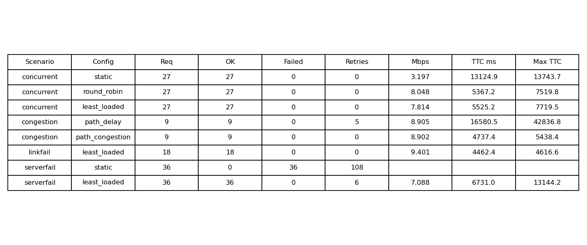
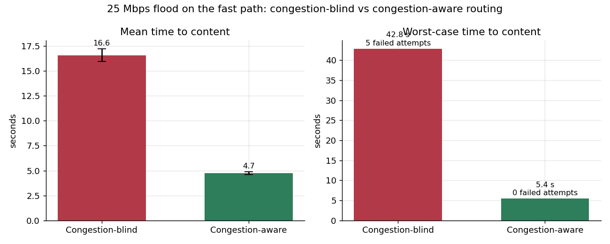
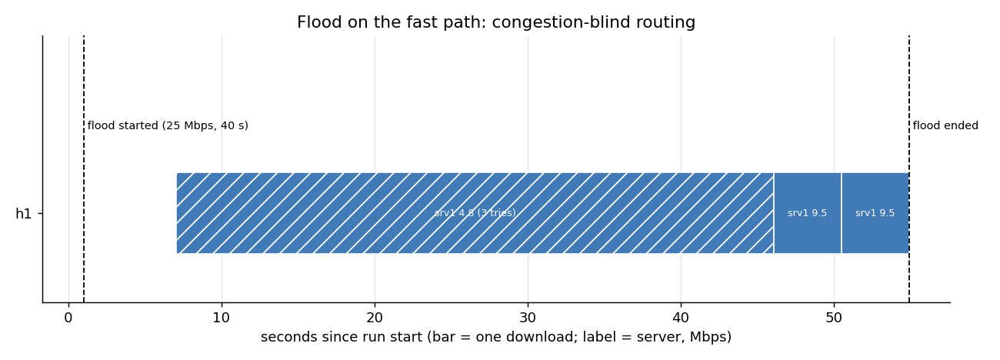
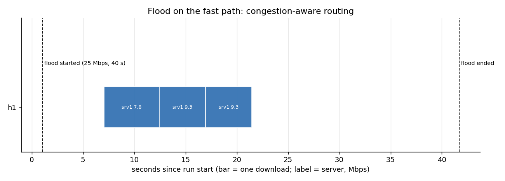
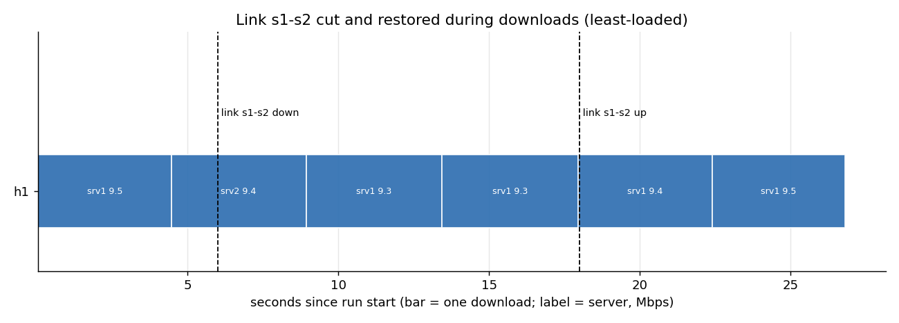
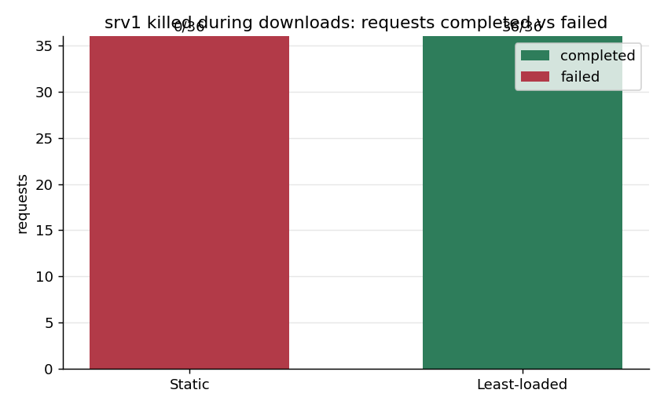
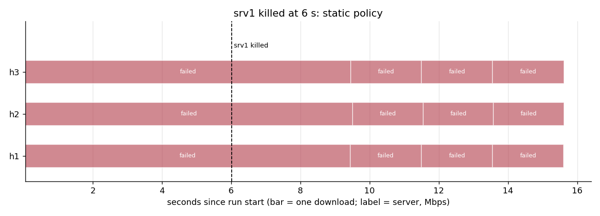
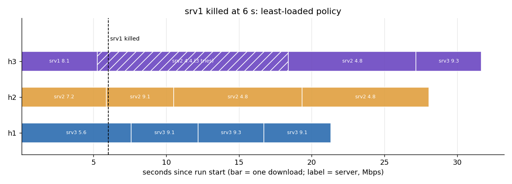

# SDN-Based Content Delivery with Dynamic Server Selection — Final Report

Computer Networks mini-project: socket programming integrated with Software-Defined Networking.

---

## Abstract

We built a content delivery service in which three clients fetch files from three identical servers
through a single virtual IP, and an SDN controller decides per TCP connection which server answers and
which path the traffic takes. Servers and clients are written with low-level Python sockets and a custom
protocol; the controller is a Ryu (OpenFlow 1.3) application. The controller combines **application
state** (UDP load reports from the servers) with **network state** (OpenFlow port statistics and port
events) to select servers, avoid congested links and reroute around failures. An automated runner
executed 24 experiments (4 scenarios, 8 configurations, 3 repetitions). Compared with a static baseline,
dynamic selection gave three concurrent clients **2.5× the throughput**; congestion-aware routing cut the
worst-case wait under a link flood from **42.8 s to 5.4 s**; and when a server was killed, the dynamic
policy completed **36/36** downloads versus **0/36** for the baseline. A cut core link was invisible to
clients, including a transfer rerouted mid-flight.

---

## 1. Problem and objectives

> Implement multiple content servers and clients where the SDN controller dynamically selects or reroutes
> traffic toward suitable servers based on network conditions.

| Requirement | How it is met | Section |
|---|---|---|
| TCP content requests | Raw-socket client/server with a custom GET/PING protocol | 3.1 |
| Multiple content servers | srv1–srv3 with identical content, behind one virtual IP | 3.2 |
| Maintain server availability | UDP load reports; 3 s silence marks a server DOWN | 3.3 |
| Monitor network conditions | Server load, liveness, link state and per-link utilisation | 3.3, 3.5 |
| Select appropriate servers | `static`, `round_robin`, `least_loaded` (+ proximity tie-break) | 3.4 |
| Dynamically modify SDN forwarding | Per-connection NAT and path rules; cleared and rebuilt on change | 3.2, 3.5 |
| Simulate server/path failures | Process kill, `link down`, UDP floods; automated with timers | 4 |
| Measure response time and throughput | Per-request CSVs: connect, TTFB, response, time-to-content, Mbps | 4, 5 |

The detailed design (component list, protocols, packet walkthrough) is in [ARCHITECTURE.md](ARCHITECTURE.md);
this report focuses on what was built, how it was evaluated, and what the results mean.

---

## 2. Topology

```
                 +---- s2 ----+        fast path  (2 ms/hop, 20 Mbps)
   h1 -+         |            |         +- srv1  10.0.0.11  (1 ms)
   h2 -+-- s1 ---+            +-- s4 ---+- srv2  10.0.0.12  (5 ms)
   h3 -+         |            |         +- srv3  10.0.0.13  (10 ms)
  sink-+         +---- s3 ----+   gen --+
                                       slow path (10 ms/hop, 20 Mbps)
```

| Element | Setting | Why |
|---|---|---|
| Two disjoint core paths | s1–s2–s4 (4 ms), s1–s3–s4 (20 ms) | Something to reroute onto |
| Server delays 1 / 5 / 10 ms | measured RTT h1→srv1 ≈ 14 ms, h1→srv3 ≈ 39 ms | A real proximity choice |
| Host links 10 Mbps, core 20 Mbps | | Each server's link is the bottleneck, so spreading load helps |
| `gen` / `sink` on 100 Mbps links | background-traffic hosts | Congest the core without touching a content server |
| Fixed IPs, MACs, DPIDs, ports | | Flow rules reference exact output ports |

The two paths form a loop. A flooding switch would cause a broadcast storm; the early tests therefore used
Ryu's STP app, which blocks one path. The final controller never floods (Section 3.2), so the loop is
harmless and both paths stay available.

---

## 3. Implementation

About 1,840 lines of Python across the application, controller, topology and test tooling.

### 3.1 Socket application (`app/`)

- **Protocol** (`protocol.py`): `GET <file>` → `OK <size> <server>` + body; `PING` → `PONG <server> <active>`;
  `ERR 400/404/500`. The header is read one byte at a time up to the newline so the body is never
  consumed by accident (TCP has no message boundaries); the body is read in a loop until exactly
  `<size>` bytes have arrived, because one `recv()` may return less than requested.
- **Server** (`server.py`): accept loop plus one thread per connection; shared counters behind a lock;
  timeouts, broken-connection handling, and rejection of path-traversal file names. A background thread
  sends `{"name", "active", "total", "bytes_sent"}` over UDP to 10.0.0.254:5555 every second.
- **Client** (`client.py`): measures connect time, time to first byte, response time, throughput and
  **time to content** (the full wait including failed attempts and retry pauses); retries on failure;
  appends one CSV row per request.

### 3.2 Virtual IP and flow rules

On the first packet (TCP SYN) of a new connection to 10.0.0.100:9000 the controller selects a server,
computes a path, and installs:

| Switch | Priority | Match | Action |
|---|---|---|---|
| s1 (client edge) | 30 | client → VIP, 5-tuple | rewrite `ip_dst`/`eth_dst` to server, output to next hop |
| s1 | 30 | server → client, 5-tuple | rewrite `ip_src`/`eth_src` to VIP, output to client |
| each transit switch | 20 | both directions, 5-tuple | output along this connection's path |
| any | 10 | destination IP | plain shortest-path routing (pings, background traffic) |
| all | 1 / 0 | IPv6 / anything | drop / send to controller |

The controller forwards the SYN itself (already rewritten), so nothing is lost, and then steps out of the
data path. Connection rules expire after 15 s idle. ARP for every known address, including the VIP and
the report address, is answered by the controller, so nothing is ever flooded.

### 3.3 Monitoring

| Condition | Source | Interval |
|---|---|---|
| Server load | `active` in the UDP report + connections assigned since the last report ("pending") | 1 s |
| Server liveness | absence of reports | DOWN after 3 s |
| Link up/down | OpenFlow `PortStatus`; a link is UP only when **both** ends are up | event-driven |
| Link utilisation | OpenFlow port statistics; Δtx_bytes / Δt, busier direction ÷ capacity | 2 s |

### 3.4 Server selection

`static` always returns srv1 and ignores health (a fair "no intelligence" baseline). `round_robin` rotates
over live servers. `least_loaded` picks the live server with the fewest active + pending connections,
breaking ties by proximity. Assignments are keyed on (client IP, client port), so a connection always maps
to the same server even if its rules are rebuilt.

### 3.5 Path selection and rerouting

Paths are computed with Dijkstra over link delays, skipping links that are down. With
`PATH_POLICY=congestion`, any link above 70% utilisation costs an extra 100 ms, which exceeds the 16 ms
difference between the paths, so a busy fast path loses to an idle slow one. Because content connections
have their own transit rules, one new connection can move without disturbing others. A link state change
clears the dynamic rules; the next packet of every connection is re-routed over the surviving topology.

---

## 4. Experimental method

`tests/run_experiments.py` executes each run unattended: start the controller with the chosen policies,
build the network, wait until all switches connect and all servers report UP, launch clients at the same
instant, inject events on a timer, save every log, and tear down. Each configuration ran **3 times**.
Batch: `results/experiments/20261008_003510/` (raw CSVs, controller logs, event timestamps, graphs).

| Scenario | Workload | Event | Configurations |
|---|---|---|---|
| concurrent | h1, h2, h3 each 3 × 5 MB | — | static, round_robin, least_loaded |
| congestion | 25 Mbps UDP gen→sink across the fast path; h1 3 × 5 MB from t=6 s | flood 40 s | path policy delay vs congestion |
| linkfail | h1 6 × 5 MB | s1–s2 down at 6 s, up at 18 s | least_loaded |
| serverfail | h1, h2, h3 each 4 × 5 MB | srv1 killed at 6 s | static, least_loaded |

Metrics: completed vs failed requests, extra attempts, throughput (payload Mbps of successful attempts),
and **time to content** (TTC), the user-visible wait. TTC matters because throughput alone hides retries:
a download that fails twice and then succeeds at full speed still reports a high Mbps.

---

## 5. Results



| Scenario | Config | Completed | Failed | Extra attempts | Mean Mbps | Mean TTC | Max TTC |
|---|---|---|---|---|---|---|---|
| concurrent | static | 27/27 | 0 | 0 | 3.20 | 13.12 s | 13.74 s |
| concurrent | round_robin | 27/27 | 0 | 0 | 8.05 | 5.37 s | 7.52 s |
| concurrent | least_loaded | 27/27 | 0 | 0 | 7.81 | 5.53 s | 7.72 s |
| congestion | delay (blind) | 9/9 | 0 | 5 | 8.91 | 16.58 s | 42.84 s |
| congestion | congestion-aware | 9/9 | 0 | 0 | 8.90 | 4.74 s | 5.44 s |
| linkfail | least_loaded | 18/18 | 0 | 0 | 9.40 | 4.46 s | 4.62 s |
| serverfail | static | 0/36 | 36 | 108 | – | – | – |
| serverfail | least_loaded | 36/36 | 0 | 6 | 7.09 | 6.73 s | 13.14 s |

A 1-repetition pass (batch `20261008_002750`) gave closely matching figures.

### 5.1 Concurrent clients: server selection


With every client on srv1, three transfers share its 10 Mbps link: 3.2 Mbps each, 13.1 s per file.
Spreading them across servers gives ~8 Mbps and ~5.4 s: **2.5× the throughput and 59% less waiting**.
Round-robin and least-loaded are statistically tied here; three identical clients on three idle servers
is exactly the case where rotation already balances perfectly. They reach ~8 rather than ~9.4 Mbps
because all three connections start before the next 2-second utilisation sample and briefly share the
20 Mbps fast path; subsequent connections see the congestion and take the other path.

### 5.2 Congestion: path selection



| Blind | Aware |
|---|---|
|  |  |

With the fast path saturated by a UDP flood, the blind controller kept sending h1 into it. The first
request timed out, was cut off part-way on retry, and only completed after the flood ended: worst-case
wait **42.8 s**, 5 failed attempts across the repetitions. The congestion-aware controller saw
`s1-s2=100%` and routed h1 via s3: every download completed first time **during** the flood, worst case
**5.4 s** (7.9× better). Mean throughput looks similar (8.9 Mbps) only because the blind run's successful
attempts happened after the flood; TTC exposes the difference.

### 5.3 Link failure: rerouting



All 18 downloads completed with no retries at 9.4 Mbps. In a separate traced run, a connection that was
mid-transfer when the link was cut had ~219 KB counted on its pre-failure rule and the remainder on the
rebuilt backup-path rule, and finished only ~18 ms slower than an undisturbed download. Ping latency rose
from 14.6 ms to ~55 ms on the slow path and returned to 13.3 ms after repair. Throughput is unaffected
because the server link, not the path, is the bottleneck, and TCP's window covers the longer RTT
(bandwidth-delay product ≈ 69 KB).

### 5.4 Server failure: availability



| Static | Least-loaded |
|---|---|
|  |  |

The static policy depends on srv1, so once it died every request failed, including those in progress:
**0/36**. Least-loaded completed **36/36**. The transfer that was on srv1 at the moment of the kill needed
up to 3 attempts: its retries arrived inside the 3-second detection window, before srv1 was marked DOWN.
With two servers left for three clients, two clients share one server (4.8 Mbps each); ties go to the
closer srv2, so h2 and h3 share srv2 while h1 keeps srv3.

---

## 6. Discussion and limitations

- **Detection speed vs false alarms.** `DEAD_AFTER = 3 s` bounds how quickly a dead server stops receiving
  traffic (the source of the 6 extra attempts). Shortening it risks marking healthy servers DOWN, which we
  observed when a server's own link was flooded and its reports were dropped.
- **Monitoring shares the data network.** Load reports travel in-band. Production systems use a separate
  management network or prioritise monitoring traffic.
- **Monitoring granularity.** Utilisation is sampled every 2 s, so connections that start simultaneously all
  see the pre-load state. Finer sampling costs controller and switch load.
- **No mid-transfer server migration.** A TCP connection is bound to its server; failure is handled by client
  retry, not by moving the connection.
- **Uniform workload, single VM.** Identical file sizes and clients, three repetitions, all on one emulated
  host: absolute numbers include emulation overhead; relative comparisons are the meaningful result.
- **Least-loaded vs round-robin.** Under uniform load they tie; the advantage of load awareness appears when
  load is uneven, as after a failure.

## 7. Problems found and fixed

| Problem | Cause | Fix |
|---|---|---|
| Ryu would not install | Python 3.14 on the VM; old build tooling | Separate Python 3.9 env; pinned setuptools/wheel, pbr |
| Pings failed after cleanup | `mn -c` also kills a running controller | Order: cleanup → controller → topology |
| Logs showed IPs not names | Mininet CLI substitutes host names | `--name=srv1` |
| "Concurrent" test was sequential | Downloads finished before the next command | Longer workloads; verify from server logs; later, a runner that starts clients together |
| Link state flapped DOWN–UP–DOWN | State taken from whichever end reported last | Link UP only when both ends are up |
| Healthy servers marked DOWN | Floods sent from servers starved their reports | Dedicated `gen`/`sink` hosts; documented limitation |
| Client summary hid retries | Only the successful attempt was timed | `time_to_content_ms` metric |

Details and screenshots for each are in [evidence/EVIDENCE.md](evidence/EVIDENCE.md).

## 8. Conclusion

The controller meets every stated requirement and does so measurably. Moving the server choice into the
network, and feeding it both application and network state, turned a single shared bottleneck into three
independent ones (2.5× throughput), turned a link flood from a multi-attempt, 40-second stall into a
transparent detour, and turned a server crash from total service loss into zero lost requests — all with
unchanged client and server code. The main design trade-offs are reaction speed (report and sampling
intervals) against monitoring overhead and false alarms.

**Future work:** prioritise or separate monitoring traffic; weight server choice by combined server load and
path utilisation rather than load first; adaptive sampling; heterogeneous workloads and more clients.

---

## Appendix A — Rubric mapping

| Deliverable / component | Marks | Evidence |
|---|---|---|
| **D1** Problem understanding & architecture | 2 | §1–2; [ARCHITECTURE.md](ARCHITECTURE.md) |
| **D1** TCP/UDP socket implementation | 4 | §3.1; `app/`; EVIDENCE Step 3 (concurrency, 404, PING) |
| **D1** Mininet + SDN implementation | 4 | §2, §3.2; `topology/`, `controller/`; EVIDENCE 4.3, 4.5 (flow table) |
| **D1** Socket–SDN integration | 3 | §3.1, §3.3; UDP load reports drive selection and health; EVIDENCE 4.4, 4.6 |
| **D1** Initial testing & demo | 2 | EVIDENCE Steps 3–4; ARCHITECTURE Appendix A (demo script) |
| **D2** Complete application functionality | 4 | §3; all scenarios 100% completion except the static baseline |
| **D2** Dynamic SDN functionality | 6 | load balancing, monitoring, congestion-aware routing, rerouting, recovery: §3.3–3.5, §5 |
| **D2** Challenging scenario / robustness | 4 | server failure, link failure, congestion: §5.2–5.4 |
| **D2** Performance evaluation & comparison | 5 | §4–5: automated, 3 repetitions, 4 conditions, static baseline, graphs |
| **D2** Documentation, demo & viva | 6 | README, this report, ARCHITECTURE, EVIDENCE, RESULTS_SUMMARY, [VIVA_QA.md](VIVA_QA.md) |

## Appendix B — Reproducing the results

```bash
cd ~/sdn-content-delivery
python3 app/make_content.py
sudo mn -c
sudo python3 tests/run_experiments.py        # 24 runs, ~17 min
python3 tests/make_graphs.py                 # writes graphs/ for the newest batch
```
