# Evidence Log — SDN Content Delivery Project

This file records screenshots taken during development and explains what each one proves.
Images are stored in the `images/` folder next to this file.

| Step | Status |
|---|---|
| Step 1 — Environment setup (Mininet + Ryu) | ✅ Done |
| Step 2 — Project topology | ✅ Done |
| Step 3 — TCP content servers and clients | ✅ Done |
| Step 4 — Own SDN controller: virtual IP, load balancing, health checks | ✅ Done |
| Step 5a — Link failure and rerouting | ✅ Done |
| Step 5b — Link monitoring and congestion-aware routing | ✅ Done |
| Step 6 — Automated experiments (24 runs, 3 repetitions) | ✅ Done |

Numeric results extracted from the screenshots are collected in [RESULTS_SUMMARY.md](RESULTS_SUMMARY.md).

Numeric results extracted from the screenshots are collected in [RESULTS_SUMMARY.md](RESULTS_SUMMARY.md).

---

## Step 1 — Environment Setup

### 1.1 Operating system and Python version
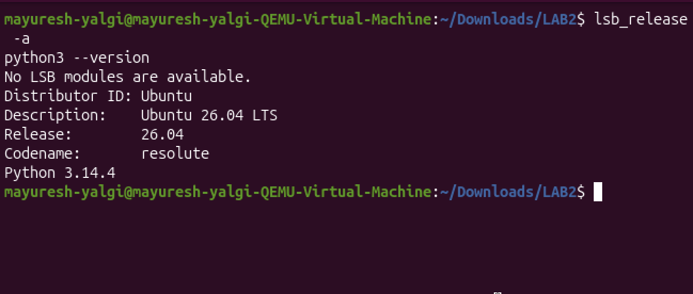

**Proves:** The development VM runs Ubuntu 26.04 LTS with Python 3.14.4 (ARM64 VM in UTM on macOS).
**Why it matters:** Ryu does not support Python this new, so a separate Python 3.9 environment was needed for the controller (see 1.2).

### 1.2 Python 3.9 environment for Ryu
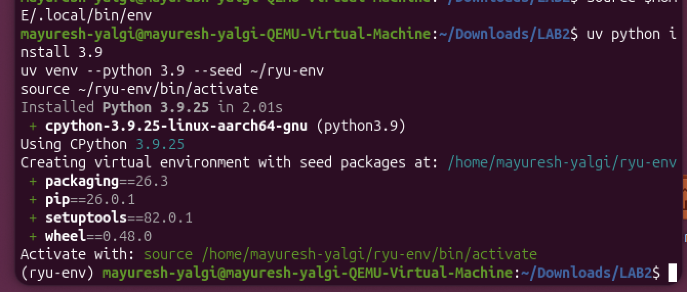

**Proves:** Python 3.9.25 was installed with `uv` and an isolated virtual environment (`~/ryu-env`) was created and activated.
**Why it matters:** Mininet runs on the system Python while Ryu runs in its own Python 3.9 environment. The two communicate over OpenFlow (TCP port 6653), so they do not need the same Python version.

### 1.3 Ryu controller running


**Proves:** Ryu 4.34 is installed correctly and the `simple_switch_13` controller app starts and waits for switches to connect.

### 1.4 First end-to-end test (single switch)
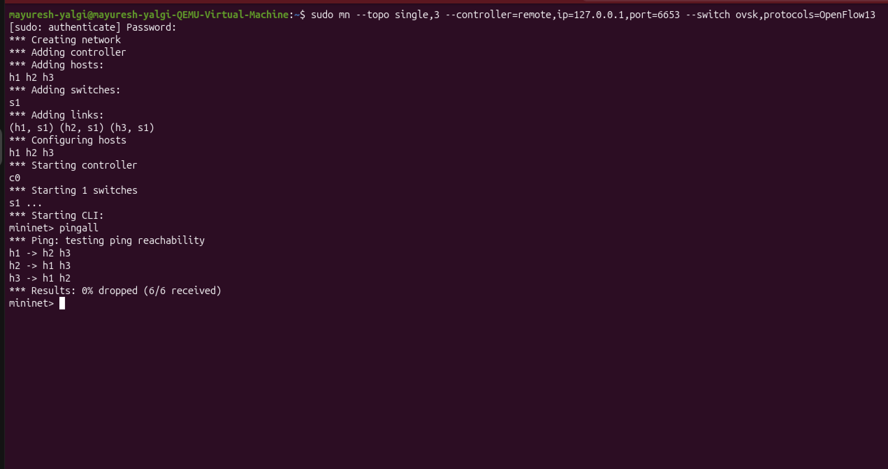

**Proves:** Mininet and Ryu work together. A 1-switch, 3-host network connected to the remote Ryu controller over OpenFlow 1.3 achieved **0% packet loss (6/6 received)**.

---

## Step 2 — Project Topology

Topology: 3 clients (h1–h3) on s1, 3 servers (srv1–srv3) on s4, two paths between them
(fast path via s2 at 2 ms per link, slow backup path via s3 at 10 ms per link).
Server access delays: srv1 = 1 ms, srv2 = 5 ms, srv3 = 10 ms. All links 10 Mbps.
Source: `topology/topo.py`

### 2.1 STP controller handling the looped topology
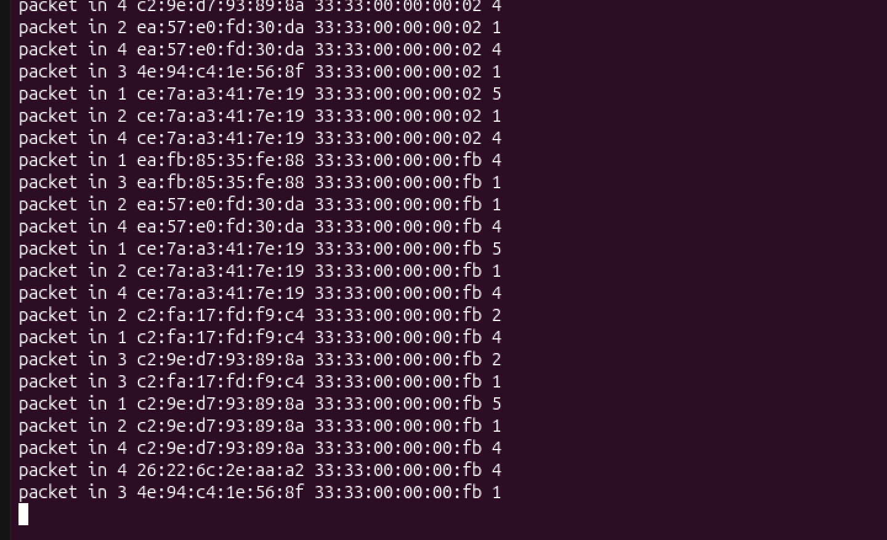

**Proves:** The Ryu STP controller (`simple_switch_stp_13`) is running and receiving `packet_in` messages from all 4 switches (DPIDs 1–4).
**Why it matters:** The two paths form a loop (s1–s2–s4–s3–s1). A basic learning switch would cause a broadcast storm, so the STP controller was used for this test to block one path temporarily.

### 2.2 Full connectivity in the project topology
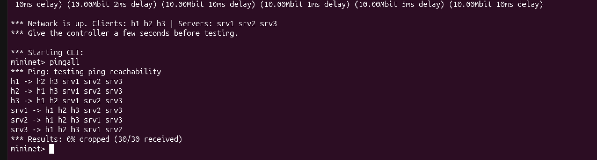

**Proves:**
- All 6 hosts can reach each other: **0% dropped (30/30 received)**.
- Link parameters were applied as designed (10 Mbit bandwidth with 1 ms, 2 ms, 5 ms and 10 ms delays shown in the startup output).

### 2.3 Server proximity differences
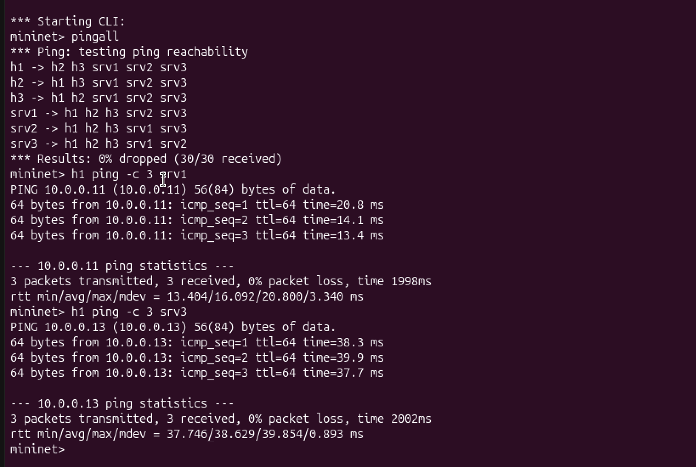

**Proves:** The servers are at genuinely different network distances from the clients.

| Test | Expected RTT | Measured avg RTT |
|---|---|---|
| h1 → srv1 | 2 × (1+2+2+1) = 12 ms | 16.1 ms (13–14 ms after the first packet) |
| h1 → srv3 | 2 × (1+2+2+10) = 30 ms | 38.6 ms |

The first ping to srv1 (20.8 ms) is higher because the switches consult the controller before a flow rule exists. The small extra delay overall is VM processing overhead.
**Why it matters:** This gives the controller a real proximity choice when selecting servers.

---

## Step 3 — TCP Content Servers and Clients

Application: multithreaded TCP server (`app/server.py`), measuring client (`app/client.py`),
shared protocol (`app/protocol.py`), test files (`app/make_content.py`: 1 KB, 1 MB, 5 MB).
Protocol: `GET <file>` → `OK <size> <server>` + data | `PING` → `PONG <server> <active>` | `ERR <code> <msg>`.
Controller during this step: `simple_switch_stp_13` (clients contact server IPs directly).

### 3.1 Network ready
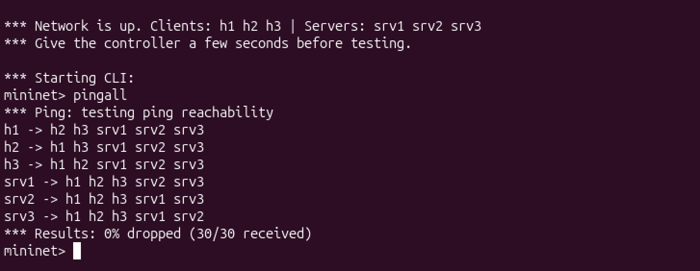

**Proves:** The topology was up with full connectivity (0% dropped, 30/30) before the application was started.

### 3.2 Three content servers running
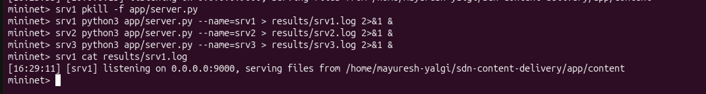

**Proves:** Three independent server processes (srv1, srv2, srv3) started inside their Mininet hosts and are listening on TCP port 9000.

### 3.3 Tests A–D: downloads, proximity, health check, error handling
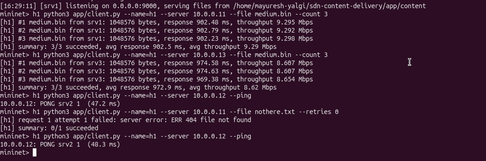

**Proves:**
- **Test A** — h1 downloaded 1 MB from srv1 (near) 3 times: all complete (1,048,576 bytes each), ~902 ms, ~9.29 Mbps (close to the 10 Mbps link limit).
- **Test B** — the same from srv3 (far): ~973 ms, ~8.62 Mbps. The farther server is measurably slower (higher RTT affects TCP).
- **Test C** — `PING` → `PONG srv2 1`: application-level health check works (~47 ms, two round trips: TCP handshake + request/reply).
- **Test D** — request for a missing file → `ERR 404 file not found`, handled cleanly by both sides.

### 3.4 Test E: concurrent clients on one server
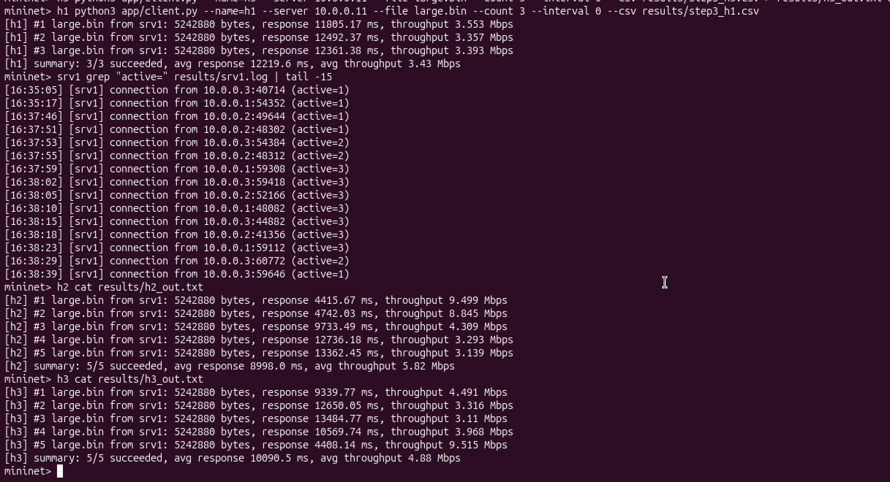

**Proves:**
- **Concurrency:** srv1's log shows `active=2` and `active=3`, so one server served three clients at the same time (thread per connection).
- **Congestion on a shared path:** a 5 MB download alone takes ~4.4 s at ~9.5 Mbps. With three clients sharing the same 10 Mbps path to srv1, each got only ~3.1–3.6 Mbps and needed ~11.8–13.5 s (about 3× slower). Their combined rate stays near 10 Mbps.
- **Why it matters:** This is the baseline problem the SDN controller must solve: all clients on one server and one path share the bottleneck, while srv2, srv3 and the second path sit unused.
- Results were also saved as CSV: `results/step3_h1.csv`, `results/step3_h2.csv`, `results/step3_h3.csv`.

### 3.5 Saved results verification
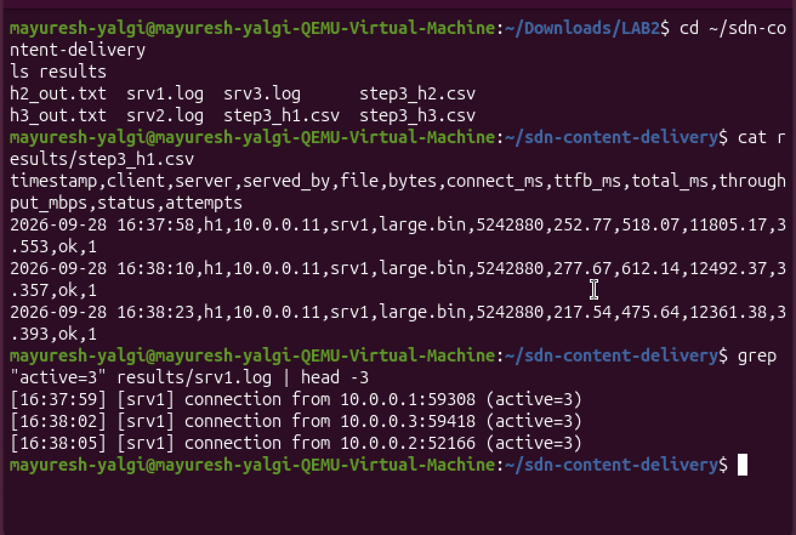

**Proves:** the Step 3 measurements are stored on disk, not only in screenshots. `results/step3_h1.csv`
holds three complete 5 MB downloads (with connect time and time-to-first-byte columns), and
`results/srv1.log` records `active=3` at three separate moments.

---

## Step 4 — Own SDN Controller (virtual IP load balancing)

Controller: `controller/lb_controller.py` with its network map `controller/net_config.py`.
Clients connect only to the **virtual IP 10.0.0.100:9000**, which belongs to no host. The controller
selects a real server per TCP connection and installs flow rules that rewrite addresses in both
directions. Policies: `static` | `round_robin` | `least_loaded`. Servers send a UDP load report to
10.0.0.254:5555 every second; the controller uses these for selection and health checking.
Core switch-to-switch links were raised to 20 Mbps so each server's own 10 Mbps link is the bottleneck.

### 4.1 All controller files in place
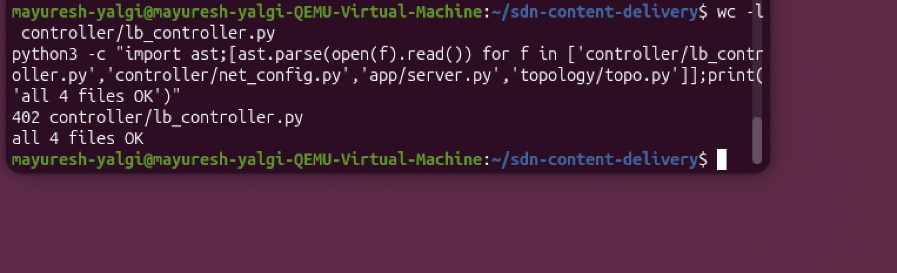

**Proves:** the controller, network map, updated server and updated topology all parse without errors.

### 4.2 Controller starts and switches connect
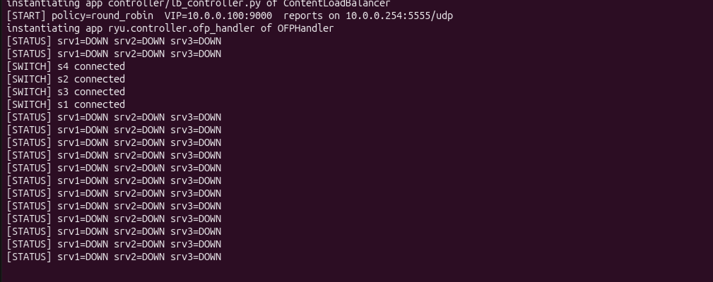

**Proves:** the controller announces its policy, VIP and report address; all four switches connect;
with no content servers running it correctly reports `srv1=DOWN srv2=DOWN srv3=DOWN`.

### 4.3 Full connectivity without STP
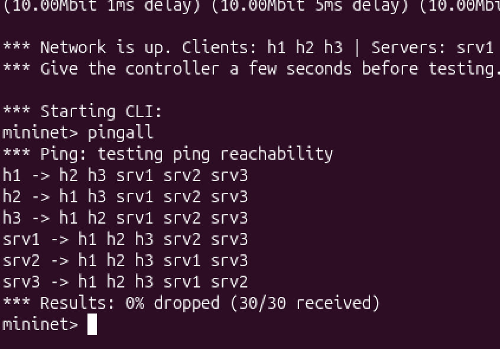

**Proves:** 0% dropped (30/30) **immediately**, with no 40-second wait. The controller answers ARP itself
and forwards along computed shortest paths, so the topology loop causes no broadcast storm and neither
path has to be blocked. Both paths stay usable for rerouting.

### 4.4 Test F — round-robin through the virtual IP
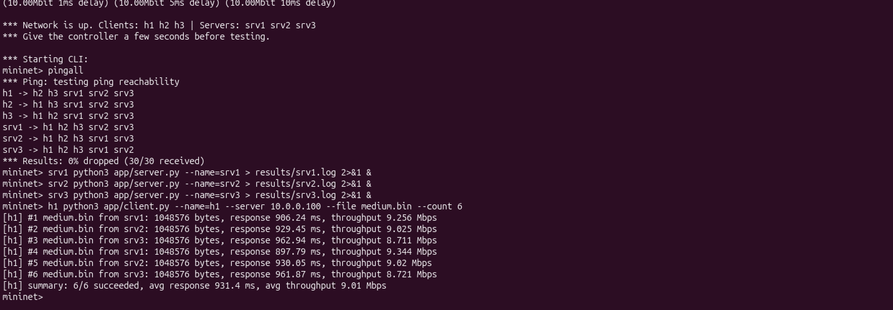
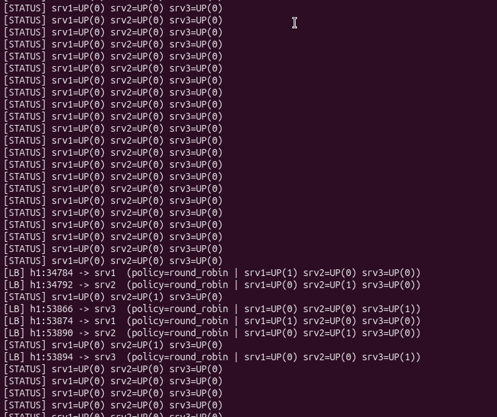

**Proves:** h1 sent six requests to 10.0.0.100 and was served by srv1, srv2, srv3, srv1, srv2, srv3;
6/6 succeeded at 9.01 Mbps average. The client never addressed a real server; only the server name in
each reply reveals which one answered. The load beside each `[LB]` decision came from that server's own
UDP report — the socket application steering the network.

### 4.5 Test G — the installed flow rules
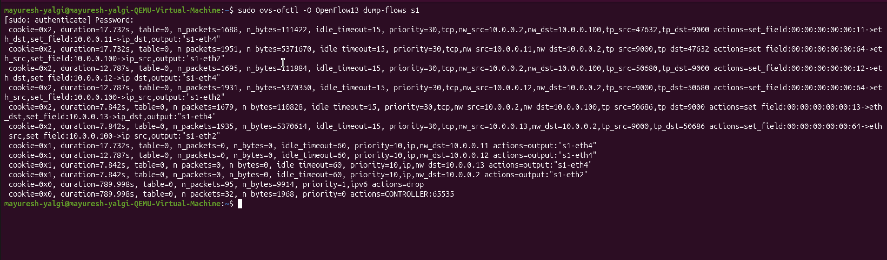

**Proves:** `ovs-ofctl dump-flows s1` shows a rewrite pair per connection:

| Direction | Match | Actions |
|---|---|---|
| Client → VIP | `nw_src=10.0.0.2, nw_dst=10.0.0.100, tp_dst=9000` | set `ip_dst`/`eth_dst` to srv1, `output s1-eth4` |
| Server → client | `nw_src=10.0.0.11, nw_dst=10.0.0.2, tp_src=9000` | set `ip_src` back to 10.0.0.100, `output s1-eth2` |

The return rules had counted ~5.37 MB each for a 5 MB file: **the data path runs in the switch, not
through the controller**, which handles only the first packet of each connection.

### 4.6 Test H — least-loaded with three concurrent clients
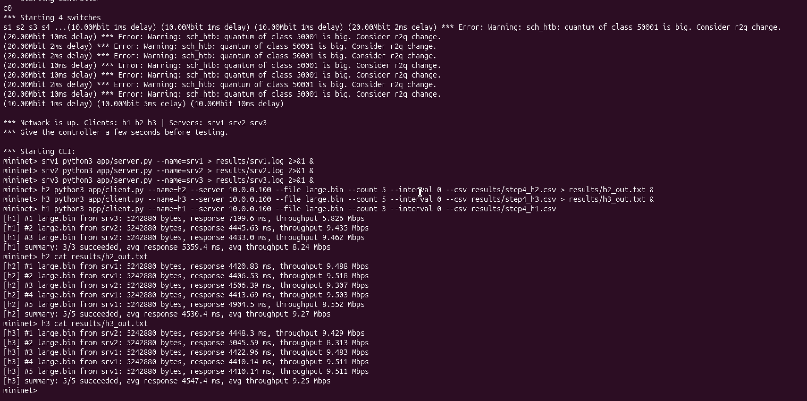
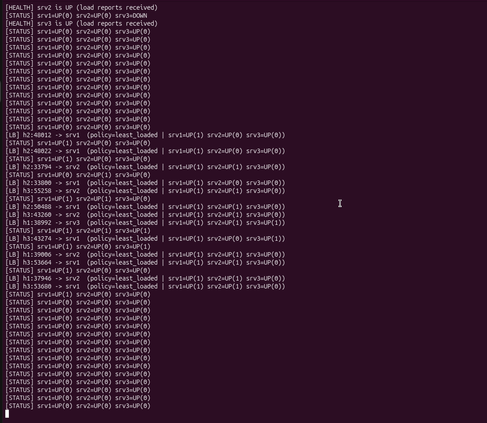

**Proves:** with the same traffic as Step 3's Test E but dynamic selection, every client roughly doubled
its throughput (mean 4.71 → 8.92 Mbps). The decisions were load-aware, e.g.
`[LB] h2:33794 -> srv2 (srv1=UP(1) srv2=UP(0) srv3=UP(0))`.

### 4.7 Test I — server failure and recovery
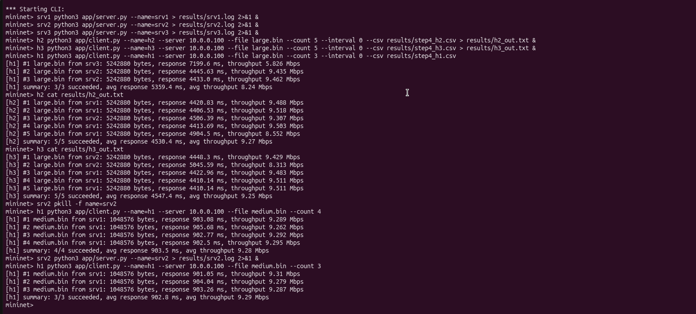
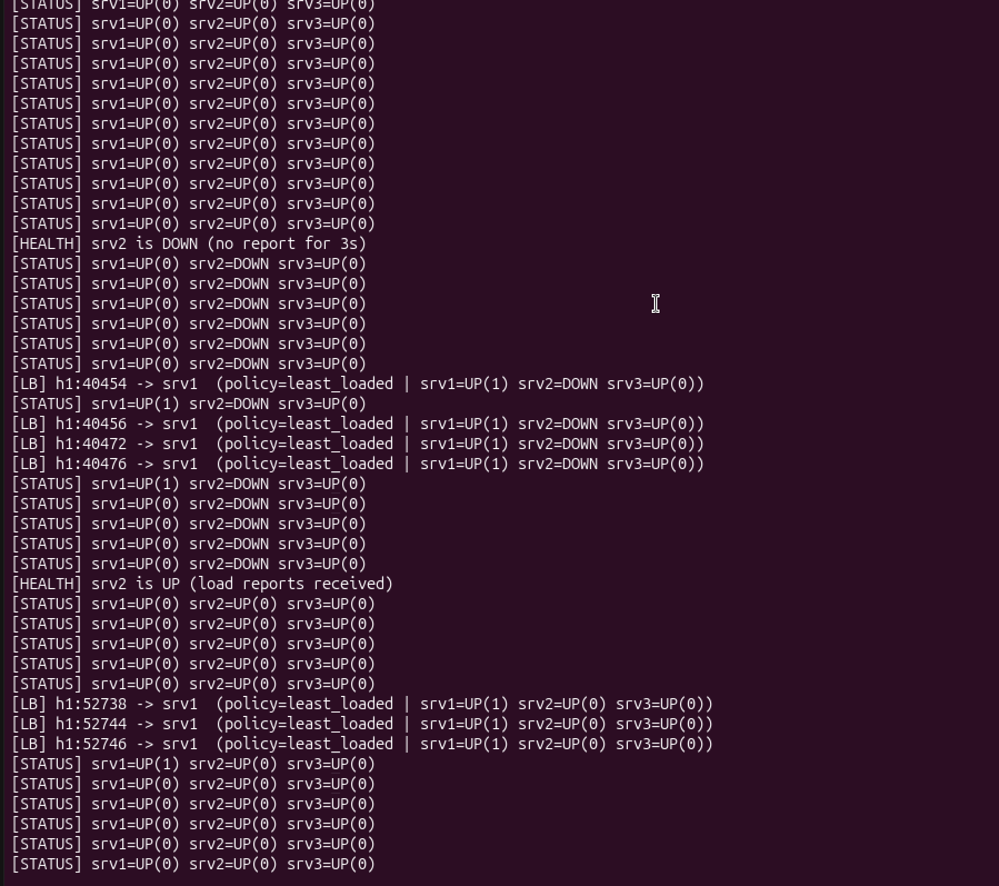

**Proves:** srv2 was killed; within 3 s the controller logged `[HEALTH] srv2 is DOWN`. The next four
requests all succeeded (4/4, 9.28 Mbps) on live servers; restarting srv2 produced `[HEALTH] srv2 is UP`.
Clients saw no errors. With all live servers idle, the proximity tie-breaker chose srv1 (1 ms) over srv3.

---

## Step 5a — Link Failure and Rerouting

While h1 downloads four 5 MB files through the VIP, link s1–s2 is cut and later restored.

### 5.1 Baseline on the fast path
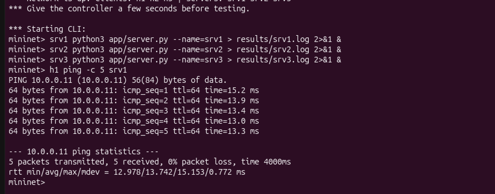

**Proves:** before the failure h1 → srv1 averages 13.7 ms, consistent with the fast path.

### 5.2 First run: reroute works, but the controller log revealed a bug
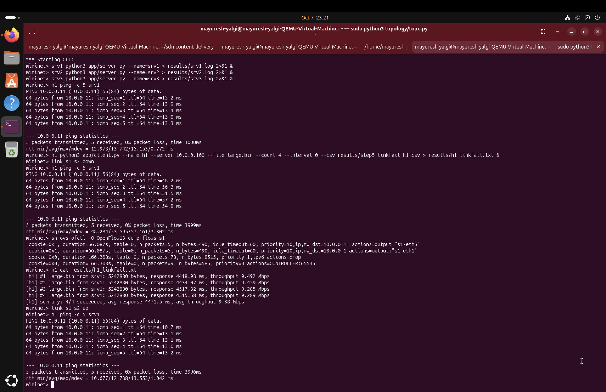
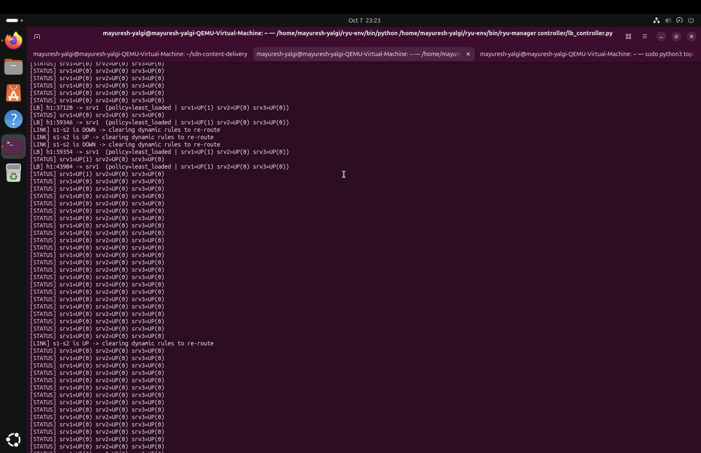

**Proves:** latency rose to 53.6 ms during the failure, s1's route switched to `output:"s1-eth5"` (backup
path), and 4/4 downloads succeeded. But one `link down` produced `DOWN`, `UP`, `DOWN` — see Issue 8.

### 5.3 Fixed run: clean reroute, mid-transfer survival, recovery
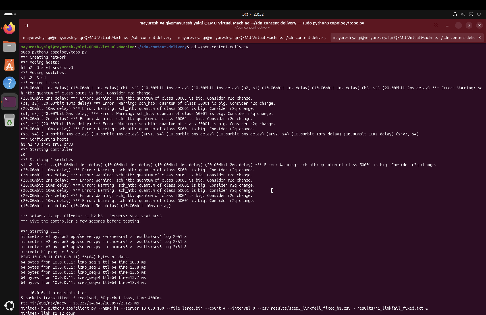
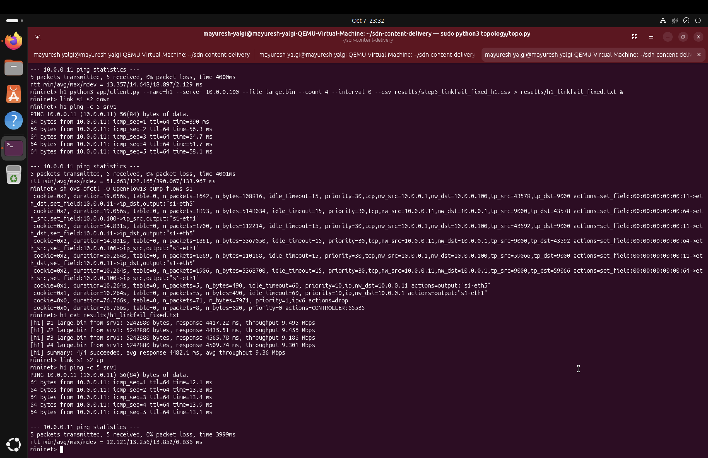
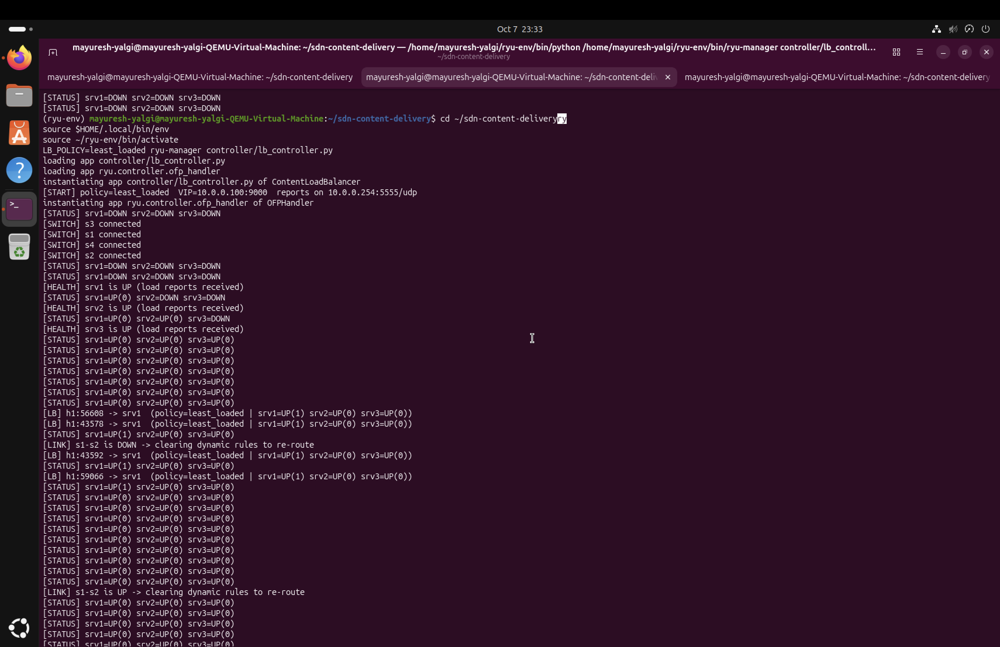

**Proves:**
- exactly one `[LINK] s1-s2 is DOWN` and one `UP`;
- all VIP rules on s1 output to `s1-eth5` during the failure;
- **a transfer survived mid-flight**: connection 43578 started before the cut; its return rule, reinstalled
  after the cut, counted 5,148,034 bytes versus 5,367,050 for a complete transfer, so ~219 KB crossed
  the fast path first and the rest the backup path; the download completed only ~18 ms slower;
- latency 14.6 ms → ~55 ms → 13.3 ms; the first ping after the cut took 390 ms while rules were rebuilt;
- throughput barely changed (9.36 Mbps): srv1's 10 Mbps link remains the bottleneck.

---

## Step 5b — Link Monitoring and Congestion-Aware Routing

Every 2 s the controller requests OpenFlow port statistics and converts byte counters into per-link
utilisation (`[MONITOR]` lines). Each content connection gets its own path, chosen by delay plus a 100 ms
penalty for links above 70%. `PATH_POLICY=delay` disables the penalty. New hosts `gen` (s4) and `sink`
(s1), with 100 Mbps links, generate background traffic without touching any content server.

### 5.4 Diagnostic: is the fast path a real bottleneck?
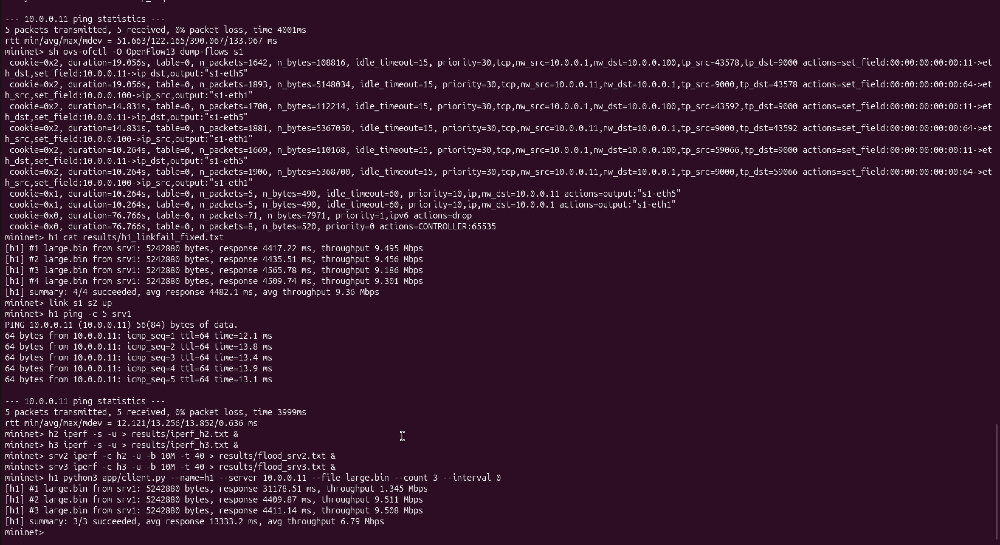


**Proves:** with two 10 Mbps UDP floods on the fast path, a 5 MB download fell from 9.5 to **1.35 Mbps**
(31 s). It also exposed a test-design flaw (Issue 9): flooding *from* content servers starved their load
reports and produced false DOWN alarms.

### 5.5 Run A — flood, congestion-awareness OFF
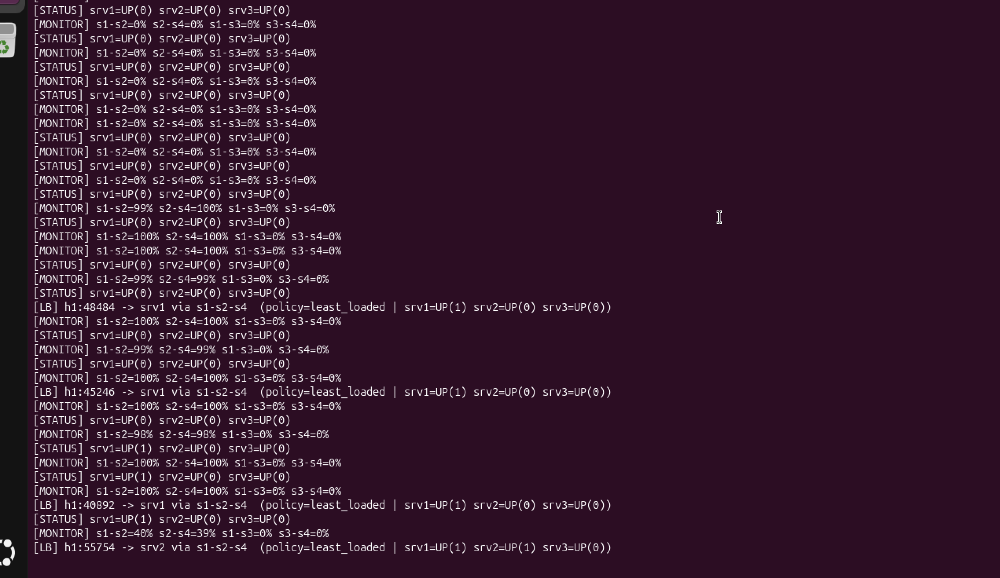
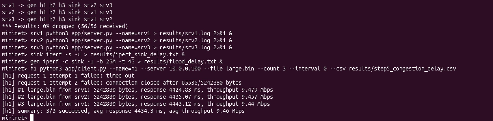

**Proves:** the monitor measured `s1-s2=100% s2-s4=100% s1-s3=0% s3-s4=0%`, yet the controller sent h1
`via s1-s2-s4`. Request 1 failed twice (timeout; then cut off after 64 KB) and succeeded only after the
flood ended. No false health alarms.

### 5.6 Run B — same flood, congestion-awareness ON
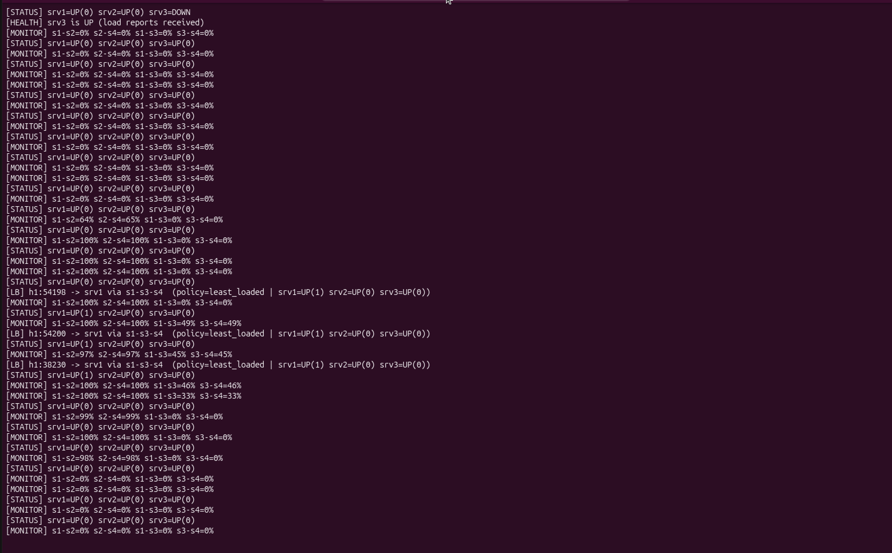
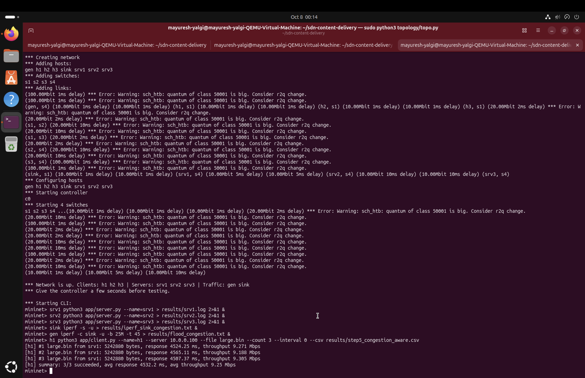

**Proves:** every connection went **`via s1-s3-s4`**; all three downloads succeeded first time at
9.19–9.31 Mbps **while the flood was running**; the monitor showed h1's traffic on the backup path
(`s1-s3=49%`) while the fast path stayed at 97–100%.

---

## Step 6 — Automated Experiments

`tests/run_experiments.py` runs every scenario unattended: starts the controller with the chosen policy,
builds the network, waits for switches and servers, launches clients at the same instant, injects failures
on a timer, saves all logs and tears down. The client records **time to content**, including retries.

### 6.1 Quick pass (1 repetition, 8 runs)
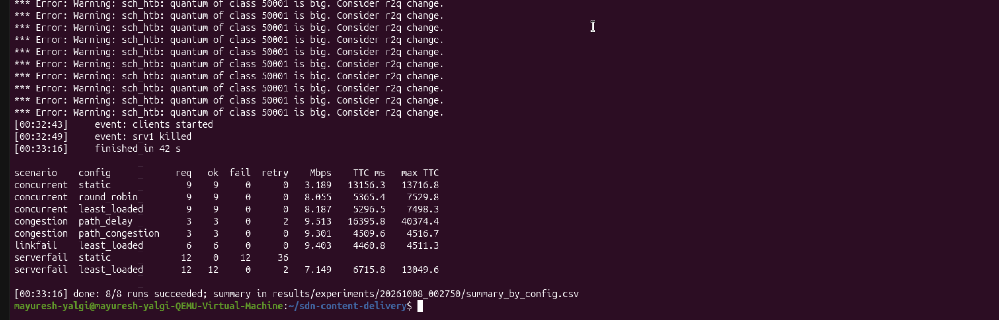

**Proves:** the runner works end to end: 8/8 runs succeeded in about 5½ minutes.

### 6.2 Full run (3 repetitions, 24 runs)
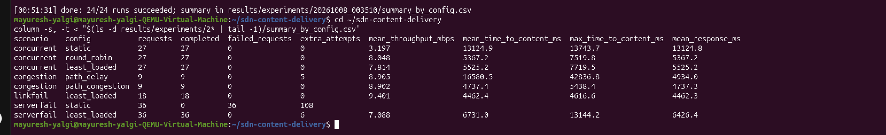

**Proves:** 24/24 runs succeeded and the results reproduce across repetitions and agree with the quick
pass. Worst-case times are in the normal range, so the host sleeping part-way did not distort any run.
Tables in RESULTS_SUMMARY.md §14–16; raw data in `results/experiments/20261008_003510/`.

---

## Issues Encountered and Fixes

Useful for the "challenges faced" section of the report and for the viva.

### Issue 1 — `uv: command not found`
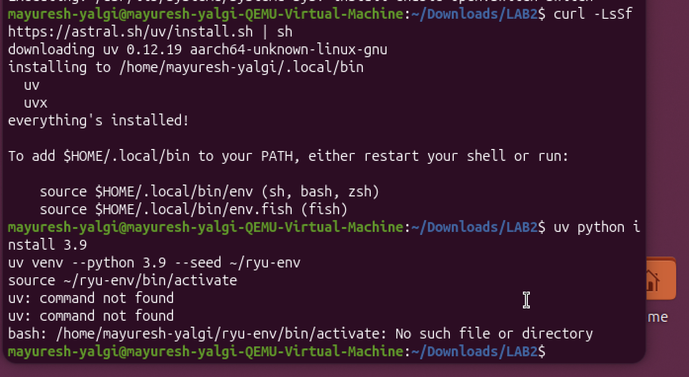

**Cause:** `uv` was installed, but the current terminal's PATH was not refreshed.
**Fix:** `source $HOME/.local/bin/env`

### Issue 2 — Ryu installation failed (`metadata-generation-failed`)
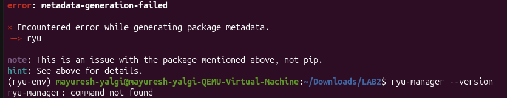

**Cause:** Ryu 4.34 is an older package. Its installer needs the `pbr` helper and older `setuptools`/`wheel` versions, which were missing because build isolation was disabled.
**Fix:**
```bash
pip install setuptools==67.6.1 wheel==0.43.0 pbr
pip install --no-build-isolation ryu eventlet==0.30.2
```

### Issue 3 — All pings failed in the project topology
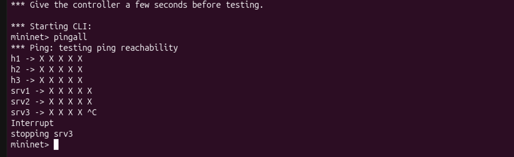
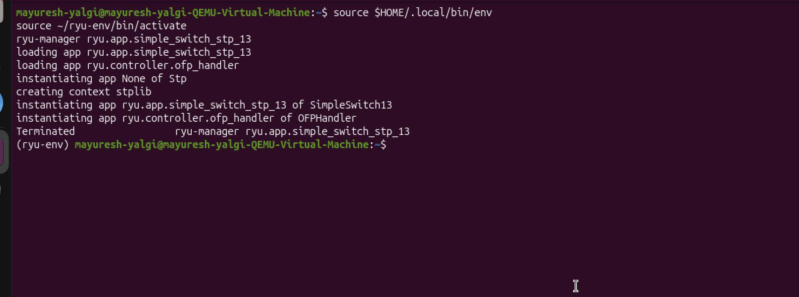

**Cause:** `sudo mn -c` (Mininet cleanup) also kills any running `ryu-manager` process. It was run after Ryu had started, so the switches had no controller.
**Fix:** Always use this order:
1. `sudo mn -c`
2. Start Ryu
3. Start the Mininet topology

### Issue 4 — Mininet replaced host names in command arguments
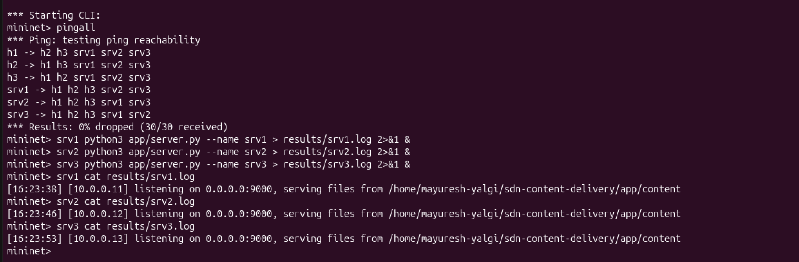

**Cause:** The Mininet CLI replaces any word that exactly matches a host name with that host's IP. `--name srv1` became `--name 10.0.0.11`, so the logs showed IPs instead of names.
**Fix:** Write the argument with `=` so it is not a separate word: `--name=srv1`, `--name=h1`.

### Issue 5 — "Concurrent" test actually ran one client at a time
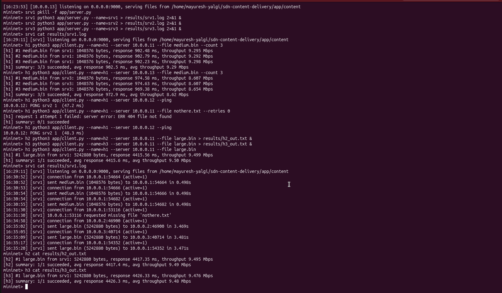

**Cause:** Each 5 MB download finished in ~4.4 s, faster than the next command could be typed. srv1's log showed only `active=1`, and each client got the full ~9.5 Mbps.
**Fix:** Make background clients download several times in a row (`--count 5 --interval 0`) so the downloads overlap. Lesson: always check server-side logs to confirm that a concurrency test really overlapped.

### Issue 6 — Large paste blocks and working directory
Files were initially not created because paste blocks ran in the wrong directory (or not at all).
**Fix:** always `cd ~/sdn-content-delivery` first and verify each file with `wc -l` after creating it.

### Issue 7 — `sch_htb: quantum of class 50001 is big` warnings
Harmless Linux traffic-control notice for 20/100 Mbps rates with the default `r2q`; shaping is unaffected.

### Issue 8 — Link state flapped DOWN–UP–DOWN on a single failure


**Cause:** each end of a link is reported separately by its own switch, and the controller set the link's
state from whichever end reported last, so the far end briefly marked it UP again.
**Fix:** track every port's state (`ports_down`); a link is UP only when **both** ends are up. Verified by a
replayed unit test and by re-running the experiment (one DOWN, one UP).

### Issue 9 — Health check raised false alarms during a server-originated flood


**Cause:** UDP floods sent *from* srv2/srv3 filled their 10 Mbps links, so their once-per-second load reports
were dropped and healthy servers were marked DOWN. TCP traffic never caused this because TCP backs off.
**Fix (test design):** background traffic now comes from dedicated `gen`/`sink` hosts.
**Remaining limitation:** health reports share the data network; production systems use a separate
management network or prioritise monitoring traffic.

### Issue 10 — Client summary hid retries
In Run A the client reported `3/3 succeeded, 4434 ms` although request 1 took three attempts (~25–30 s).
**Fix:** the client now records `time_to_content_ms`, the full wait including failed attempts.
